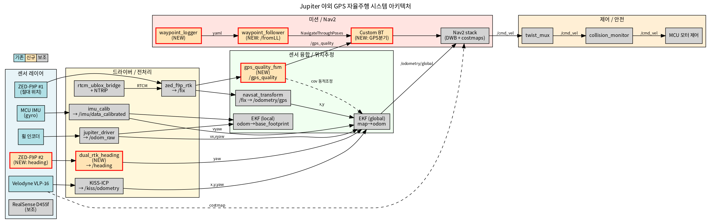
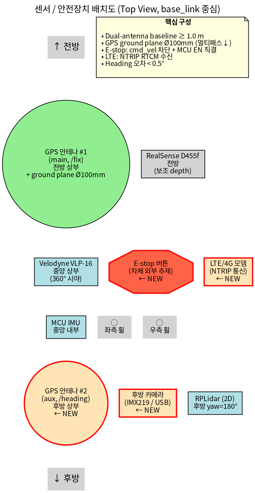
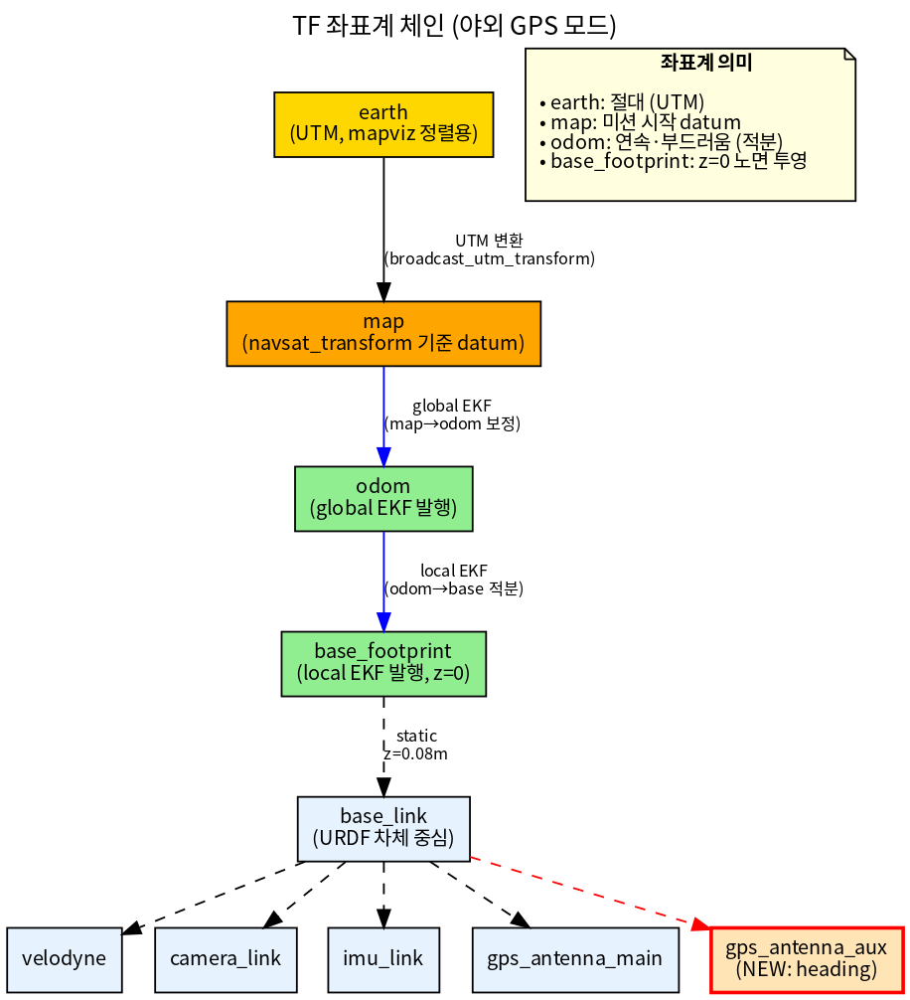
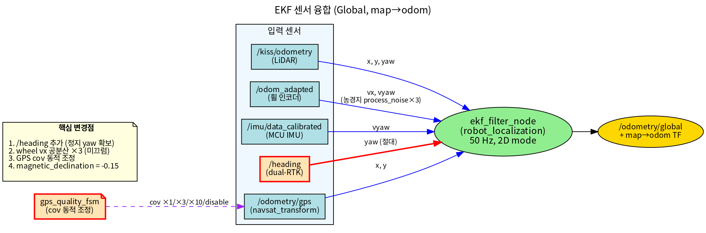
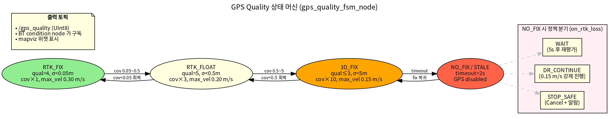
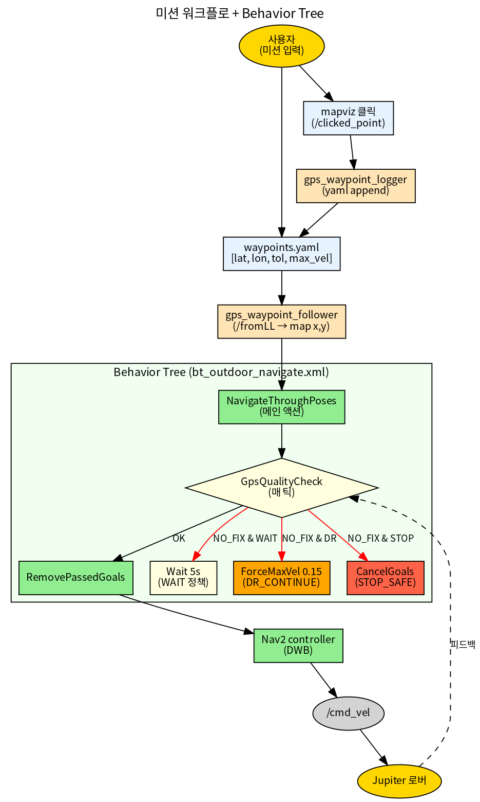
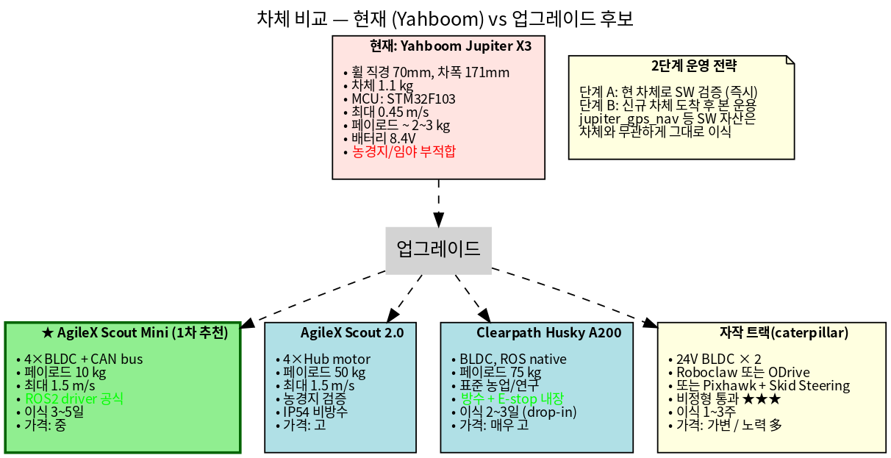
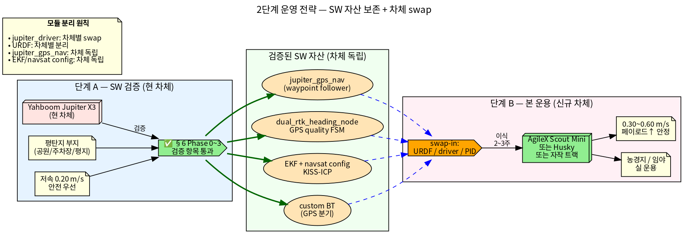
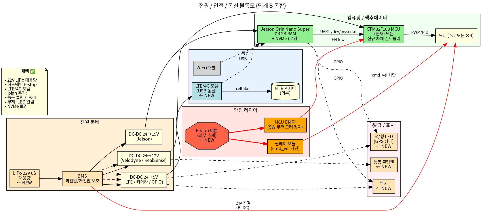
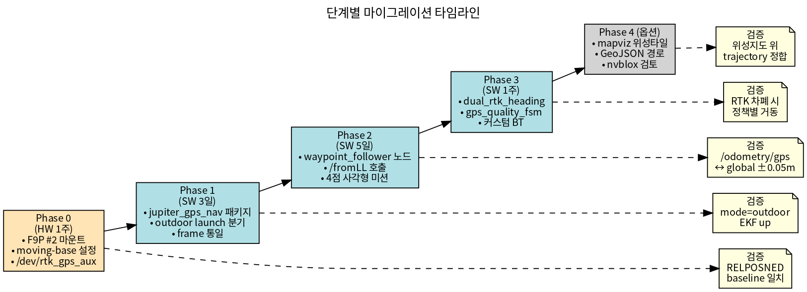

<!-- _class: lead -->

# Jupiter 로버 야외 GPS 자율주행 재설계

### `jupiter_ws_ros2` 워크스페이스

**목표**: 사용자가 입력한 GPS 좌표(lat/lon)로 야외 자율주행

**환경**: 농경지 / 임야  ·  **저속 0.3 m/s**  ·  **RTK 정밀도 ~1 cm**

작성일: 2026-05-06

---

## 목차

### Part I — SW 스택 설계
1. 배경 / 문제 정의 · 2. 현재 상태 진단 · 3. 사용자 결정사항 (1차+2차)
4. 시스템 아키텍처 · 5. 센서 구성 · 6. 소프트웨어 스택 (`jupiter_gps_nav`)
7. TF 체인 · 8. EKF 센서 융합 · 9. GPS Quality FSM
10. 미션 워크플로 + BT · 11. Nav2 / 안전 레이어 튜닝

### Part II — HW 재검토 + 차체 업그레이드 (NEW)
15. **HW 5개 질문 답변** (Pixhawk / 카메라 / 모터 / 초음파 / Jetson)
16. **차체 업그레이드 + 모터** (Yahboom → Scout Mini 등)
17. **2단계 운영 전략** (단계 A: SW 검증 → 단계 B: 본 운용)
18. **추가 HW** (E-stop / LTE / 22V LiPo / 쿨링 / 부저·LED)
19. 단계 A → B 전환 체크리스트

### Part III — 검증 / 결론
20. 단계별 마이그레이션 (Phase 0~4)
21. 검증 방안 · 22. 위험 / 트레이드오프 · 23. 다음 단계

---

## 1. 배경 — 왜 재설계인가

### 현재 워크스페이스의 진화 방향

`jupiter_ws_ros2` 는 **실내 SLAM + Isaac VSLAM 융합** 중심으로 발전.
야외 GPS 자율주행을 위한 **부품들은 이미 있으나 끝단이 비어 있음**.

### 비어 있는 3칸

| # | 결손 항목 | 영향 |
|---|---|---|
| 1 | <span class="red">lat/lon → 미션 입력 끝단</span> | 사용자가 GPS 좌표를 직접 줄 방법 없음 |
| 2 | <span class="red">정지 상태 절대 yaw</span> | single-antenna RTK 라 출발 시 방향 모름 |
| 3 | <span class="red">RTK 음영 대응 상태머신</span> | 신호 끊기면 어떻게 할지 정책 없음 |

### 본 재설계의 목적

위 **3칸을 메우는 것**이 핵심. 기존 실내 스택은 **폐기 없이 `mode` arg 분기**로 보존.

---

## 2. 현재 상태 진단 — 있는 것

### 하드웨어
- ✅ **ZED-F9P RTK GPS** (NTRIP via gnssdata.or.kr, `/fix` ~1cm 정밀도)
- ✅ **Velodyne VLP-16** (3D LiDAR 360°)
- ✅ **RealSense D455f** (보조 depth)
- ✅ **MCU IMU** (gyro bias 보정 적용)
- ✅ **휠 인코더** (50 Hz, 동적 공분산)
- ✅ RPLidar (2D, 후방)

### 소프트웨어
- ✅ `rtcm_ublox_bridge` + `zed_f9p_rtk` (자체 구현 NTRIP)
- ✅ `robot_localization` dual EKF (local + global)
- ✅ `navsat_transform_node` (`/fix` → `/odometry/gps`)
- ✅ `kiss-icp` LiDAR odometry
- ✅ Nav2 (DWB, RotationShim, collision_monitor)
- ✅ `nav2_waypoint_follower` apt 설치됨

---

## 3. 현재 상태 진단 — 빠진 것

### 핵심 결손 (3가지)

```
사용자 lat/lon ──[?]──> map x,y ──> Nav2 액션
                  ↑
              여기가 비어 있음
```

| 결손 | 구체적 부재 |
|---|---|
| **GPS waypoint 끝단** | yaml 입력 → `/fromLL` 호출 → `NavigateThroughPoses` 액션 클라이언트 없음 |
| **Heading 초기화** | dual-antenna 또는 magnetometer 부재. 정지 시 yaw 알 수 없음 |
| **품질 FSM** | RTK fix/float/no-fix 별 동작 정책, BT 분기 없음 |

### 부수적 결손
- mapviz 위성타일 시각화 미구성
- `magnetic_declination_radians: 0.0` (한국 -0.15 미반영)
- frame 혼재 (`base_link` vs `base_footprint`)

---

## 4. 사용자 결정사항 (확정)

### 1차 결정 — SW 스택

| 항목 | 선택 | 영향 |
|---|---|---|
| **Heading 초기화** | <span class="green">Dual-antenna RTK 추가</span> | F9P #2 (moving-base). 정지 yaw 가 RTK 정확도로 |
| **운영 환경** | <span class="green">농경지 / 임야</span> | 0.3 m/s, 풀/이랑 ground filter, 미끄럼 대비 |
| **사전 지도** | <span class="green">Mapless GPS-only (1차)</span> | slam_toolbox off, LiDAR 실시간 obstacle 만 |
| **기존 indoor 스택** | <span class="green">`mode` arg 분기 유지</span> | jupiter_nav_VO / nvblox 보존 |

### 2차 결정 — HW / 차체 (NEW)

| 항목 | 선택 | 영향 |
|---|---|---|
| **차체** | <span class="red">대형 차체로 업그레이드</span> | Yahboom X3 → Scout Mini / Husky / 자작 트랙. **2단계 운영** (§14) |
| **카메라 추가** | <span class="green">후방 USB/CSI 1대</span> | 자가 점검 + 후방 모니터링. URDF 에 `camera_rear_link` |
| **안전** | <span class="green">하드웨어 E-stop</span> | cmd_vel 차단 릴레이 + MCU EN 핀 직결 |
| **통신/전원** | <span class="green">LTE/4G + LiPo 22V</span> | NTRIP 야외 인터넷, 1~2시간 운용 가능 |

---

## 5. 시스템 아키텍처 (전체)



신규 컴포넌트(주황색)가 기존 스택(파랑)과 어떻게 연결되는지 한눈에.

---

## 6. 센서 구성 — 유지

| 센서 | 역할 | 토픽 | 야외 적합성 |
|---|---|---|---|
| ZED-F9P #1 | 절대 위치 | `/fix` | RTK fix ~1cm |
| MCU IMU | 회전 속도 | `/imu/data_calibrated` | 양호 |
| 휠 인코더 | dead-reckoning | `/odom_raw` | 농경지 미끄럼 → 공분산↑ |
| Velodyne VLP-16 | 장애물 + LiDAR odom | `/velodyne_points`, `/scan` | 야외 1차 obstacle |
| RealSense D455f | 보조 근거리 depth | `/camera/depth/...` | 직사광 시 신뢰도↓ (보조용) |
| RPLidar | 후방 2D | `/scan_back` | collision_monitor 후방 안전 |

### 환경별 한계
- **풀/이랑** → Velodyne z-band filter 필수 (`z ∈ [0.10, 1.5]m`)
- **수목 캐노피** → RTK fix→float 빈번, FSM 으로 대응
- **진흙/미끄럼** → 휠 odom 공분산 동적 증가

---

## 7. 센서 구성 — 신규 도입

### Dual-Antenna RTK (Phase 0)

| 항목 | 사양 |
|---|---|
| 모듈 | **ZED-F9P #2** (moving-base 모드, F9P #1 과 RTCM 공유) |
| 베이스라인 | **1.0 ~ 1.5 m** (종축 정렬, 동일 높이) |
| 출력 | UBX `NAV-RELPOSNED` → `/heading` (sensor_msgs/Imu, yaw only) |
| Heading 정밀도 목표 | **< 0.5°** @ 1m baseline |

### 대안 비교 (왜 F9P #2 인가)

| 방식 | 장점 | 단점 |
|---|---|---|
| <span class="green">F9P #2 (선택)</span> | 비용 저렴, 단독 GPS 로도 활용 가능 | 셋업 약간 복잡 |
| F9H (heading 전용) | 셋업 단순 | 단독 사용 불가 |
| 9축 IMU (mag) | 가장 저렴 | 모터 자기간섭, calib 까다로움 |

---

## 8. 센서 배치도 (Top View)



- **Dual-antenna baseline ≥ 1m**, 종축 정렬, 동일 sky view
- **GPS ground plane Ø100mm** 멀티패스 감소
- 신규: **후방 카메라**, **외부 추제 E-stop**, **LTE/4G 모뎀**

---

## 9. 소프트웨어 스택 — 신규 패키지

### `jupiter_gps_nav/` (자체 작성, 신규)

```
src/jupiter_gps_nav/
├── launch/
│   └── outdoor_gps_full.launch.py     # mode:=outdoor 진입점
├── config/
│   ├── waypoints_example.yaml         # lat/lon 미션 리스트
│   ├── nav2_outdoor_params.yaml       # 농경지 튜닝
│   ├── ekf_local.yaml / ekf_global.yaml
│   ├── navsat_transform.yaml
│   └── bt_outdoor_navigate.xml        # GPS 분기 BT
└── jupiter_gps_nav/
    ├── gps_waypoint_logger_node.py    # 클릭 → yaml 추가
    ├── gps_waypoint_follower_node.py  # /fromLL → NavigateThroughPoses
    ├── dual_rtk_heading_node.py       # F9P #2 RELPOSNED → /heading
    └── gps_quality_fsm_node.py        # /fix → /gps_quality
```

### apt 추가 설치
```bash
sudo apt install -y ros-humble-mapviz ros-humble-mapviz-plugins \
    ros-humble-tile-map ros-humble-swri-transform-util \
    ros-humble-nmea-navsat-driver
```

---

## 10. 좌표계 / TF 체인



- `earth` UTM (mapviz 위성타일 정렬용)
- `map` ← `navsat_transform` 기준 datum
- `base_footprint` 로 통일 (현재 혼재 해소)
- `gps_antenna_aux` 신규 link 추가

---

## 11. 센서 융합 — EKF (Global)



### 농경지 튜닝 핵심
1. <span class="red">`/heading` 추가</span> → 정지 yaw 확보
2. <span class="red">wheel `vx` process_noise ×3</span> → 미끄럼 대비
3. <span class="red">GPS cov 동적 조정</span> → FSM 이 ×1/×3/×10 배율 적용
4. <span class="red">`magnetic_declination = -0.15`</span> → 한국 평균

---

## 12. GPS Quality 상태머신



`gps_quality_fsm_node.py` 가 `/gps_quality` (UInt8) publish.
BT 와 mapviz 위젯이 구독.

---

## 13. 미션 워크플로 + Behavior Tree



### 입력 형식 (`waypoints_example.yaml`)
```yaml
mission:
  loop: false
  on_rtk_loss: WAIT          # WAIT | DR_CONTINUE | STOP_SAFE
waypoints:
  - {lat: 37.5665, lon: 126.9780, tolerance_m: 1.0, max_vel: 0.30}
  - {lat: 37.5670, lon: 126.9785, tolerance_m: 0.5, max_vel: 0.20}
```

---

## 14. Nav2 / 안전 레이어 튜닝 (농경지)

### Nav2 (`nav2_outdoor_params.yaml`)
| 항목 | 값 |
|---|---|
| DWB max_vel_x | **0.30 m/s** (저속) |
| DWB max_vel_theta | 0.6 rad/s |
| Local costmap | 6×6m, res 0.05m, source = `/scan` + D455 depth |
| Global costmap | rolling 30×30m, source = `/scan` only |
| Velodyne ground filter | z-band `[0.10, 1.5]m` |
| Inflation radius | 0.3 m |
| Footprint | 0.4×0.45 m (실측 후 조정) |

### collision_monitor
- **Slow zone** 0.6×0.5m → max_vel 0.15 m/s
- **Stop zone** 0.35×0.35m → halt
- Source: `/scan_merged` (Velodyne 2D + RPLidar 후방)

---

<!-- _class: lead -->

# Part II — HW 재검토

### 사용자 5개 질문 답변 + 차체 업그레이드 + 추가 안전·전원

> Pixhawk 변경? · 카메라 다중? · 모터? · 초음파? · Jetson Orin Nano 충분?

---

## 15. HW 5개 질문 — 결론 한눈에

| # | 질문 | 결론 | 핵심 근거 |
|---|---|---|---|
| 1 | Pixhawk 변경? | <span class="red">변경 X</span> | Nav2 + dual-RTK + twist_mux 가 ArduPilot Rover 강점 동등 구현. 자작 트랙 시 재검토 |
| 2 | 카메라 다중? | <span class="green">후방 1대 추가</span> | Velodyne 이 1차 obstacle. CSI 포트 가용, USB 3.0 은 D455 점유 |
| 3 | 모터 교체? | <span class="green">차체와 묶어 교체</span> | 현 차체 1.1kg/페이로드 한계 → 차체 업그레이드와 통합 |
| 4 | 초음파 필요? | <span class="red">불필요</span> | 풀/먼지에 약함. 대안: ToF 1D (노면 hole) 또는 짐벌 D455 |
| 5 | Orin Nano 충분? | <span class="green">1차 스택 충분</span> | CPU ~90% / RAM 2.2GB 추정. nvblox+멀티캠 추가 시 NX/AGX |

### 현재 HW 스냅샷 (확인된 사실)

- **Jetson** Orin Nano Engineering Reference **Super** · 7.4GB RAM · JetPack 6 (L4T R36.4.3) · NVMe
- **MCU** STM32F103RCT6 (Yahboom YB-ERF01) · UART 115200 · `/dev/myserial`
- **차체** Yahboom Jupiter X3 · 휠 r=35mm · 축간 171mm · max 0.45 m/s · 페이로드 ~2~3kg

---

## 16. 차체 업그레이드 + 모터



### 1차 추천: <span class="green">AgileX Scout Mini</span> (가격·성능 균형, ROS2 driver 공식 지원)

- 자작 트랙 채택 시: **Pixhawk + ArduPilot Rover Skid Steering + MAVROS 브릿지** 빠른 부트스트랩 가능
- 모터는 차체와 함께 결정 — 단독 모터 교체는 의미 적음

---

## 17. 2단계 운영 전략



### 핵심: SW 자산은 차체 독립

`jupiter_gps_nav`, EKF/navsat config, BT XML 은 **차체 swap 시 그대로 이식**.
바뀌는 것은 `jupiter_driver`, URDF, PID 뿐.

---

## 18. 추가 HW — 전원 / 안전 / 통신 블록도



### 사용자 채택 ✅
- 22V 6S LiPo 대용량 + BMS · 하드웨어 E-stop (외부 추제) · LTE/4G 모뎀 (USB 동글)

### plan 추가 권장
- GPS 안테나 ground plane Ø100mm · IP54 케이스 · 능동 쿨링팬 + nvpmodel 25W
- `/battery/voltage` publish · 부저 + 적/황 LED · NVMe 로깅 파티션 (`/data/bags`)
- E-stop → MCU EN 핀 직결 (SW 무관 모터 정지)

### 운영 단계 도입 (2차)
- 무선 RC 오버라이드 (FrSky/FlySky + ROS2 joy) · 짐벌 카메라 · 헤드라이트 · ToF 1D down-facing

---

## 19. 단계 A → B 전환 체크리스트

### 단계 A 종료 조건 (현 Yahboom 차체)

- [ ] §18 검증 4항목 모두 통과 (좌표 변환 / mapviz 오버레이 / 품질별 거동 / bag)
- [ ] 정원·주차장 4점 사각형 미션 안정 동작 (0.20 m/s)
- [ ] dual-antenna 임시 마운트(baseline ~0.3m)로 heading FSM 검증
- [ ] GPS quality FSM WAIT/DR_CONTINUE/STOP_SAFE 정책별 거동 표 작성

### 단계 B 시작 조건 (신규 차체)

- [ ] 신규 차체 ROS2 driver 동작 확인 (단독 cmd_vel → 휠 회전)
- [ ] URDF 신규 작성 + TF 일치 검증 (`view_frames`)
- [ ] 휠 PID / max_vel / collision_monitor footprint 신규 차체 기준 재튜닝
- [ ] dual-antenna baseline 1.0m 이상 마운트
- [ ] E-stop / RC 오버라이드 / IP54 케이스 / 22V LiPo 통합
- [ ] 본 운용 첫 미션 전 빈 농경지에서 STOP_SAFE 정책 강제 발동 시험

---

## 20. 단계별 마이그레이션 — Timeline



| Phase | 기간 | 의존성 |
|---|---|---|
| 0 | 1주 | F9P #2 모듈 도착 + 마운트 제작 |
| 1 | 3일 | HW 없이 가능 (스켈레톤) |
| 2 | 5일 | Phase 0 완료 권장 (real heading) |
| 3 | 1주 | Phase 0~2 완료 |
| 4 | 옵션 | 운영 안정화 후 |

---

## 21. 검증 방안

### 21.1 좌표 변환 정합
```bash
ros2 run tf2_tools view_frames
ros2 topic echo /odometry/gps
ros2 topic echo /odometry/global
ros2 service call /fromLL robot_localization/srv/FromLL \
    "{ll_point: {latitude: 37.5665, longitude: 126.9780, altitude: 0.0}}"
# → map x,y 가 측량값과 ±0.05m 일치 확인
```

### 21.2 mapviz 위성타일 오버레이
`/odometry/global`, `/fix` trajectory 가 실제 도로/이랑 위에 정합되는지 육안 검증.

### 21.3 RTK 품질별 거동 비교 (시나리오 A/B/C)
| 시나리오 | RTK 상태 | 기대 동작 |
|---|---|---|
| A. 옥상 | RTK_FIX | 정상 0.30 m/s |
| B. 건물 옆 | RTK_FLOAT | 0.20 m/s + cov ×3 |
| C. 안테나 차폐 | NO_FIX | `on_rtk_loss` 정책 발동 |

### 21.4 필수 bag 토픽
`/fix /heading /imu/data_calibrated /odom_raw /kiss/odometry /odometry/gps /odometry/local /odometry/global /tf /tf_static /gps_quality /cmd_vel /cmd_vel_safe /goal_pose`

---

## 22. 위험 / 트레이드오프

| 위험 | 완화 방안 |
|---|---|
| Dual-antenna baseline < 0.5m → heading 노이즈↑ | 1.0m 이상 확보, 마운트 강성↑ |
| 농경지 풀이 LiDAR obstacle 로 오인식 | z-band filter + voxel ground segmentation |
| RTK NTRIP 셀룰러 끊김 | NTRIP 자동 재접속 (이미 `simple_ntrip.py` 보유), float 로 fallback |
| KISS-ICP 풀밭/모래밭 매칭 실패 | 휠 odom + RTK 보강, EKF process_noise 동적 조정 |
| `mode:=outdoor/indoor` 동시 실행 → TF 충돌 | launch 내 mutual-exclusive 가드, 점검 스크립트 |
| 직사광 환경 D455 depth 신뢰도↓ | global costmap 에서 D455 source 제외, local costmap 보조용만 |

---

## 23. 다음 단계 — 결정 / 발주 항목

### 즉시 결정 필요 (HW)
- [ ] **차체 모델 확정** — Scout Mini / Husky / 자작 트랙 중 선택
- [ ] **F9P #2 모듈 발주** + dual-antenna 마운트 도면 (baseline 1.0~1.5m)
- [ ] **22V 6S LiPo + BMS** 발주 (1~2시간 운용 용량)
- [ ] **LTE/4G USB 모뎀** + NTRIP SIM 카드
- [ ] **하드웨어 E-stop 버튼** (외부 추제 + 릴레이) + IP54 케이스
- [ ] **운영 시험 부지 확정** (단계 A 평탄지 + 단계 B 농경지/임야)

### 단계 A — Phase 1 (HW 도착 전 즉시 시작 가능)
- [ ] `jupiter_gps_nav` 패키지 스켈레톤 생성 (`mode:=outdoor` arg)
- [ ] `outdoor_gps_full.launch.py` + `ekf_global.yaml` declination/공분산 수정
- [ ] frame `base_footprint` 통일 + 후방 카메라 URDF 추가

### 단계 A — Phase 2 (single-RTK 만으로 검증 가능)
- [ ] `gps_waypoint_follower_node.py` + `/fromLL` 서비스 연동
- [ ] 4점 사각형 미션 (정원/주차장, 0.20 m/s)

### 단계 B (신규 차체 도착 후)
- [ ] 신규 차체 ROS2 driver 통합 + URDF swap
- [ ] dual-antenna baseline 1.0m+ 영구 마운트 + 22V LiPo 통합
- [ ] STOP_SAFE 정책 강제 발동 시험 → 농경지 본 운용

---

<!-- _class: lead -->

## 토론 / 질문

- **단계 A 즉시 착수 vs HW 발주 우선?** Phase 1 SW 는 HW 없이 시작 가능
- **차체 최종 결정**: Scout Mini (1차 추천) vs Husky vs 자작 트랙
- **자작 트랙 채택 시**: Pixhawk + ArduPilot Rover Skid Steering 검토할지
- **운영 시험 부지** (단계 A 평탄지 + 단계 B 농경지/임야) 확정
- **mapviz 위성타일 소스**: OSM / 카카오맵 / 자체 타일 서버?

---

## 참고 자료

- 본 plan 파일: `/home/jetson/.claude/plans/jupiter-ws-ros2-swift-jellyfish.md`
- 기존 outdoor 스택: `src/jupiter_nav/launch/jupiter_outdoor_gps.launch.py`
- RTK 셋업 TIL: `/home/jetson/TIL_RTK_Setup.md`
- Velodyne 셋업 TIL: `/home/jetson/TIL_Velodyne_Setup.md`
- Nav2 GPS 튜토리얼: https://docs.nav2.org/tutorials/docs/navigation2_with_gps.html
- `robot_localization` `/fromLL`: https://docs.ros.org/en/humble/p/robot_localization/

### 다이어그램 소스 (`docs/redesign_outdoor_gps/images/`)
- `01_system_architecture.{gv,png}` — 전체 시스템
- `02_tf_chain.{gv,png}` — TF 체인
- `03_ekf_fusion.{gv,png}` — EKF 융합
- `04_gps_quality_fsm.{gv,png}` — 상태머신
- `05_mission_workflow.{gv,png}` — 미션 + BT
- `06_phase_timeline.{gv,png}` — 마이그레이션
- `07_sensor_layout.{gv,png}` — 센서 배치 (후방 카메라 + E-stop + LTE)
- `08_chassis_comparison.{gv,png}` — 차체 비교 (Yahboom vs Scout/Husky/자작)
- `09_two_stage_operation.{gv,png}` — 2단계 운영 전략 (단계 A → B)
- `10_power_safety_block.{gv,png}` — 전원/안전/통신 블록도

### 재렌더링 명령
```bash
cd /home/jetson/jupiter_ws_ros2/docs/redesign_outdoor_gps/images
for f in *.gv; do dot -Tpng -Gdpi=130 "$f" -o "${f%.gv}.png"; done
```
